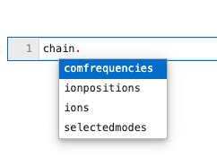

# LinearChain

## Theoretical Background

In some sense a linear chain is the simplest configuration of ions, but it is also the most common. Ions are trapped in effective three-dimensional, harmonic electric potential ``V``:

```math
V \propto m\omega_x^2x^2 + m\omega_y^2y^2 + m\omega_z^2z^2
```

where the magnitude of ``\omega_z`` is set to be signficantly smaller than ``\omega_x`` and ``\omega_y``. With this choice, if in addition the kinetic energy of the ions is sufficiently small, the ions will *crystallize* into the shape of a linear chain along the ``z``-direction where the confining force due to the external potential is perfectly balanced by the inter-ion Coulomb repulsion. 


Any residual motion can then be described by small excursions of the ions away from their equilibrium positions where the inter-ion Coulomb repulsion (no longer zero) is well described to first-order. I.e. the Coulomb interaction can be linearized such that the resulting motion is analagous to a linear spring-mass system. 

For example, the motion of the ``i^{th}`` ion in the ``x``-direction is given by:

```math
m\ddot{x}'_i = -\sum_j K_{ij} x'_j
```

where ``x'_i`` is the diplacement of the ``i^{th}`` ion from equilibrium and ``K_{ij}`` describes the (first-order) force per unit length that ion `i` experiences due to a change in position of ion `j`. By diagonalizing ``K``, we find a collection of normal modes ``\beta^k`` and associated eigenfrequencies ``\nu_k`` such that a general solution for ``x`` is given by:

```math
x'_i(t) = \sum_k c_k \beta^k_i e^{i\nu_k t}
```

But in this regime, the kinetic energy of the ions is comparable to the ground state energy so the description must be quantized. It turns out, this can be done by associating a quantum harmonic oscillator with each normal mode ``\beta^k``, such that the displacement of ion ``i`` from equilibrium is given by:

```math
\hat{x}'_i = \sum_k c_k \beta_i^k \sqrt{\frac{\hbar}{2m\nu_k}}(\hat{a}_k^{\dagger} + \hat{a}_k) 
```

where ``\hat{a}^{\dagger}_k`` and  ``\hat{a}_k`` satisfy the normal commutation relation ``[\hat{a}_k, \hat{a}^{\dagger}_k] =1``. Given a collection of ions defined by their mass and charge, IonSim will solve for these normal modes of motion and their associated vibrational frequencies. 

!!! note
    In the above, we've implicitly assumed that the ions were identical in mass and charge. The situation is a bit more complicated when this is no longer true, but IonSim can handle these situations as well.

## Purpose of LinearChain in IonSim

**DocString**: [`LinearChain`](@ref)

The main purpose of a `LinearChain` object is to organize and store information about the coupled center of mass motion for a chain of ions, which can then be used to construct a [`Chamber`](@ref) as a next step towards simulating a trapped ion experiment. Assuming a harmonic potential confining potential and a linearized, inter-ion Coulomb interaction as described earlier, the structure of this motion is uniquely specified given three frequencies. 

## Buiding a LinearChain in IonSim

Creating an instance of `LinearChain` requires three arguments:

+ `ions`: An iterable collection of ions`<:Ion`.
- `comfrequencies`: A `NamedTuple{:x, :y, :z}` specifying the vibrational frequencies for the center of mass modes, e.g. `comfrequencies = (x=3e6, y=3e6, z=1e6)`.
+ `selectedmodes`: Another `NamedTuple{:x, :y, :z}` but with arguments that are lists of integers e.g. `selectedmodes = (x=[1, 3], y=[:], z=[1:3, 5])`. These specify a subset of the normal modes that will actually be taken into account during simulation.

An optional keyword argument `N::Int` can be specified, which sets the Hilbert space dimension assoicated with each generated normal mode (this defaults to 10).


!!! note
    In the case that all ions have the same mass and charge, the COM motion of the ion chain factors into three unique modes (one for each spatial coordinate). And these are typically used to characterize the normal mode structure of the chain since they are the same independent of the number of ions. 
    
    However, When the ions are not identical, this is no longer true. In this case, `comfrequencies` corresponds to the lowest (highest) frequency normal mode in the axial (radial) directions, in correspondence with the homogeneous case.

For example:

```@example lc1
using IonSim # hide
c = Ca40()
b = Be9()
chain = LinearChain(
    ions=[c, c, b, b],
    comfrequencies=(x=7e6,y=7e6,z=1e6), 
    selectedmodes=(x=[:], y=[1:3], z=[1, 2])  # Note: selectedmodes now supports slicing
)
```

Creates a 4-ion chain of two calcium ions and 2 beryllium ions where the smallest normal mode axial frequency is 1 MHz and the largest frequency in both of the radial directions is 7 MHz. `chain` has four fields (which you can see by typing a period and hitting the tab key).



`chain.comfrequencies` and `chain.ions` correspond to the arguments used to instantiate `chain`. `chain.ionpositions` is a vector of floats representing the positions of the ions in the chain in meters:

```@example lc1
ionpositions(chain) .* 1e6
```

`chain.selectedmodes` now contains a NamedTuple of `VibrationalMode`s:

```@example lc1
selectedmodes(chain).x
```

which are quantum operators further described in the [`VibrationalMode`](@ref) section.

```@example lc1
typeof(selectedmodes(chain).x[1]) <: IonSimBasis
```

The normal mode structure can be better understood by using IonSim's `visualize` function:

```@example lc1
visualize(chain, ẑ, [:])
```

```@example lc1
visualize(chain, x̂, [:], format="circles")
```

## Buiding a LinearChain from YAML
One can alternatively build a `LinearChain` from a yaml file. Suppose the contents of some file `normal_mode.yaml` are 

```yaml
---
x:
  - frequency: 1e6
    mode: [0.1, 0.5, 0.3, 0.8]
  - frequency: 2e6
    mode: [0.3, 0.6, 0.5, 3]
y:
  - frequency: 8e6
    mode: [1, 1, 1, 1]
ionpositions: [1,2,3,4]
```

Then the syntax is:

```@example lc1
chain = LinearChain_fromyaml(
    ions=[c, c, c, c],
    yaml="normal_mode.yaml",  
)
```
## Additional Functionality

A normal mode calculation can be performed without the need for a `LinearChain` using `full_normal_mode_description`.

```@example lc1
mass_list =    [1, 1, 1, 1, 1]
charge_list =  [2, 1, 2, 2, 1]
fnm = full_normal_mode_description(mass_list, charge_list, (x=5e6, y=5e6, z=1e6))
fnm.x
```

## Full List of Functions with LinearChain as Argument

```@autodocs
Modules = [IonSim]
Order   = [:function]
Pages   = [iontraps.jl]
```